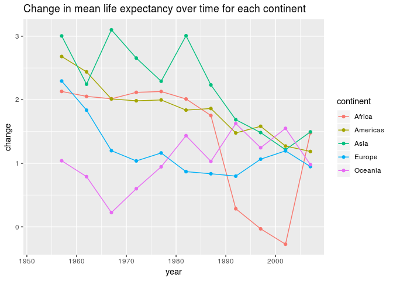
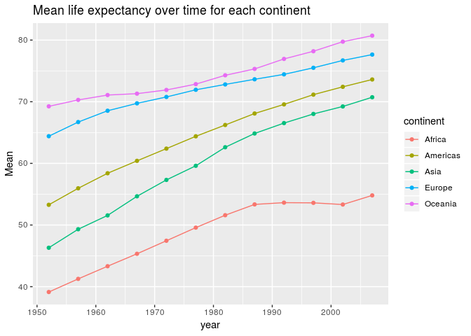
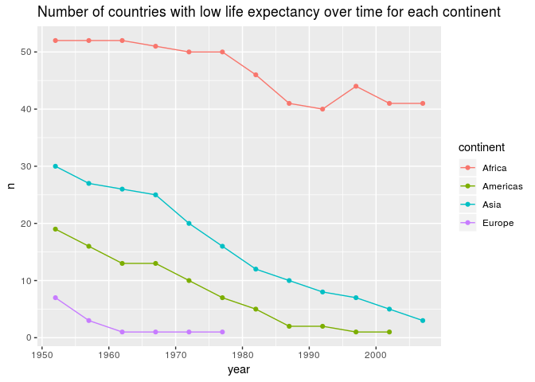

Homework 3
================
Sarafa Iyaniwura
September 27, 2018

-   [**Homework 03: USe dplyr/ggplot2 to manipulate and explore data**](#homework-03-use-dplyrggplot2-to-manipulate-and-explore-data)
    -   [Loading data and libraries](#loading-data-and-libraries)
        -   [Displaying the gapminder data using **knitr::kable()** function](#displaying-the-gapminder-data-using-knitrkable-function)
    -   [Task menu](#task-menu)
        -   [Get the minimum and maximum of GDP per capital for all continents](#get-the-minimum-and-maximum-of-gdp-per-capital-for-all-continents)
        -   [Verifying result using another method](#verifying-result-using-another-method)
        -   [Look at the spread of GDP per capita within the coninents](#look-at-the-spread-of-gdp-per-capita-within-the-coninents)
        -   [Compute a trimmed mean of life expectancy for different years. Or a weighted mean, weighting by population.](#compute-a-trimmed-mean-of-life-expectancy-for-different-years.-or-a-weighted-mean-weighting-by-population.)
        -   [How is life expectancy changing over time in different continent?](#how-is-life-expectancy-changing-over-time-in-different-continent)
        -   [How is average life expectancy changing over time in different continent?](#how-is-average-life-expectancy-changing-over-time-in-different-continent)
        -   [Report the absolute and/or relative abundance of countries with low life expectancy over time by continent.](#report-the-absolute-andor-relative-abundance-of-countries-with-low-life-expectancy-over-time-by-continent.)
        -   [Find countreis with interesting stories](#find-countreis-with-interesting-stories)

**Homework 03: USe dplyr/ggplot2 to manipulate and explore data**
=================================================================

Loading data and libraries
--------------------------

``` r
suppressPackageStartupMessages(library(tidyverse))
```

    ## Warning: replacing previous import by 'tibble::as_tibble' when loading
    ## 'broom'

    ## Warning: replacing previous import by 'tibble::tibble' when loading 'broom'

``` r
suppressPackageStartupMessages(library(gapminder))
```

### Displaying the gapminder data using **knitr::kable()** function

To begin, let us display the first few row of the gapminder data using the **kable()** function in order to have a feel of how it displays tables.

``` r
gapminder %>%  # loads the gapminder data and pipes it into the next line
  head() %>%  # gets the first few rows of the gapminder data and pipes it into the next line
  knitr::kable(caption = "Head")  # displays the result of the head() function using the kable function
```

| country     | continent |  year|  lifeExp|       pop|  gdpPercap|
|:------------|:----------|-----:|--------:|---------:|----------:|
| Afghanistan | Asia      |  1952|   28.801|   8425333|   779.4453|
| Afghanistan | Asia      |  1957|   30.332|   9240934|   820.8530|
| Afghanistan | Asia      |  1962|   31.997|  10267083|   853.1007|
| Afghanistan | Asia      |  1967|   34.020|  11537966|   836.1971|
| Afghanistan | Asia      |  1972|   36.088|  13079460|   739.9811|
| Afghanistan | Asia      |  1977|   38.438|  14880372|   786.1134|

Wow!! the table looks great!! This function shall be used to display all the tables in this assignment. In cases, where the tables are too long, we shall display only a few rows.

Task menu
---------

### Get the minimum and maximum of GDP per capital for all continents

``` r
# compute the minimum and maximum GDP per capital for each continent and save the result as MinMax ( Minimum and Maximum )
MinMax <- gapminder %>%  # loads the gapminder data and pipe it  into the next line
  group_by(continent) %>%  # groups data according to continents
  summarize(Min.GdpPerCap = min(gdpPercap),Max.GdpPerCap= max(gdpPercap)) # computes the min. and max. of GDP per capital for each continent

# displaying  the result using table
MinMax %>% # loads the MinMax data
  knitr::kable() # display the result of the previous line nicely function
```

| continent |  Min.GdpPerCap|  Max.GdpPerCap|
|:----------|--------------:|--------------:|
| Africa    |       241.1659|       21951.21|
| Americas  |      1201.6372|       42951.65|
| Asia      |       331.0000|      113523.13|
| Europe    |       973.5332|       49357.19|
| Oceania   |     10039.5956|       34435.37|

### Verifying result using another method

Let us verify that our result is correct using another method. Let us filter the data for Africa only and then find the minimum and maximum of the GDP per capital.

``` r
gapminder %>%  # loads gapminder data and pipe to the next line
  filter(continent=='Africa') %>%  # extract the data for African countries only
  summarize(MIN.GdpPerCap=min(gdpPercap),MAX.GdpPerCap=max(gdpPercap)) %>% # finds the max and min GDP per cap. for each continent
  knitr::kable() # display the result of the previous line nicely function
```

|  MIN.GdpPerCap|  MAX.GdpPerCap|
|--------------:|--------------:|
|       241.1659|       21951.21|

This is exactly the same as what we got from the first code. Let us check for another continent, say Europe.

``` r
gapminder %>%  # loads gapminder data and pipe to the next line
  filter(continent=='Europe') %>%   # extract the data for African countries only
  summarize(MIN.GdpPerCap=min(gdpPercap),MAX.GdpPerCap=max(gdpPercap)) %>% # finds the max and min GDP per cap. for each continent
  knitr::kable() # display the result of the previous line nicely function
```

|  MIN.GdpPerCap|  MAX.GdpPerCap|
|--------------:|--------------:|
|       973.5332|       49357.19|

The result is also the same with what we got from the first code. Based on these two tests, we can conclude that our first code for the minimum and maximum of GDP per capital for each contient is correct.

Now, let us plot our result using **ggplot()** function.

``` r
# plotting the result using scatter plot
MinMax %>%   # loads the MinMax data
  ggplot(aes(continent,color= Data)) +  # specifies the x,y variables to be plotted
  geom_point(aes(y=Min.GdpPerCap, col="Minimum")) +  # specifies the type of plot
  geom_point(aes(y=Max.GdpPerCap, col="Maximum")) + # specifies the type of plot
  scale_y_log10() +             # rescales the y variable to log scale
  ggtitle("Min. and Max. GDP per capital for each continent") +  # adds a title
  labs(y ="GDP Per Capital")     # labels y-axis
```


**Observations:**

We observe from this plot that Africa has the lowest minimum GDP per capital and Oceania has the largest minimum. In addition, Asia has the highest maximum, while Africa has the lowest maximum. In fact, one can easily see from this result the minimum GDP per capital in Oceania is close to the maximum GDP per capital in Africa. We can also see from this plot that Asia has the largest range of GDP per capital (max - min).

### Look at the spread of GDP per capita within the coninents

``` r
spreadGDP <- gapminder %>%  # loads gapminder data and pipes it  into the next line
  group_by(continent) %>%  # groups data continent by continent
  summarize(Mean=mean(gdpPercap),Variance = var(gdpPercap),Std_dev=sd(gdpPercap),
            Range=diff(range(gdpPercap)),Int_Qt_Ran=IQR(gdpPercap)) # compute the mean,variance,standard deviation, range, and interquartile range for the GDP per capital for each continent

# displaying  the result using table
spreadGDP %>% # loads spreadGDP
  knitr::kable() # display the result of the previous line nicely function
```

| continent |       Mean|   Variance|   Std\_dev|      Range|  Int\_Qt\_Ran|
|:----------|----------:|----------:|----------:|----------:|-------------:|
| Africa    |   2193.755|    7997187|   2827.930|   21710.05|      1616.170|
| Americas  |   7136.110|   40918591|   6396.764|   41750.02|      4402.431|
| Asia      |   7902.150|  197272506|  14045.373|  113192.13|      7492.262|
| Europe    |  14469.476|   87520020|   9355.213|   48383.66|     13248.301|
| Oceania   |  18621.609|   40436669|   6358.983|   24395.77|      8072.258|

``` r
# plotting the result using scatter plot
spreadGDP %>%   # ggplot(aes(year,change,group=continent, color=continent)) + 
  ggplot(aes(continent,y = value,color= Data,group=continent)) +
  geom_point(aes(y=Variance, col="Variance")) + 
  geom_point(aes(y=Mean, col="Mean")) +
   geom_point(aes(y=Range, col="Range")) +
  geom_point(aes(y=Std_dev, col="Standard deviation")) + 
  geom_point(aes(y=Int_Qt_Ran, col="Interquartile range")) +
  scale_y_log10() + ggtitle("The spread of GDP per cap. for each continent") + 
  labs(y ="GDP Per Capital")
```


**Observations:**

Ths first observation here is to see that the GDP per capital from Asia has the largest variance, and range. This agrees with our observation from the previous exercise. Another thing we can see from this data that the variance is high for each continent, this implies that there is high variability in the GDP per capital for each continent. For Europe and Asia, the mean and interquartile range of each of the continents is very close, while for Africa and Americas, the mean and standard deviation are close to each other. In addition, one can see from the plot that the standard deviation for Europe and Oceania is less than the interquartile range, while for the other continents, the reserve is the case.

The spread can also be presented for several years. In this case, we shall group the data by continent and year, and then follow the same procedure as done in the code above. When plotting the data, **facet\_wrap()** function is used to plot the result for all the years together. We shall compute the spread for the years greater than 1987.

``` r
spreadGDP <- gapminder %>%  # loads gapminder data and pipes it  into the next line
  group_by(continent,year) %>%  # groups data continent by continent
  filter(year > 1987) %>%  # extract data for year greater than 1987
  summarize(Mean=mean(gdpPercap),Variance = var(gdpPercap),Std_dev=sd(gdpPercap),
            Range=diff(range(gdpPercap)),Int_Qt_Ran=IQR(gdpPercap)) # compute the mean,variance,standard deviation, range, and interquartile range for the GDP per capital for each continent

# displaying  the result using table
spreadGDP %>% # finds the max and min GDP per cap. for each continent
  knitr::kable() # display the result of the previous line nicely function
```

| continent |  year|       Mean|   Variance|   Std\_dev|      Range|  Int\_Qt\_Ran|
|:----------|-----:|----------:|----------:|----------:|----------:|-------------:|
| Africa    |  1992|   2281.810|    6991136|   2644.076|  13111.261|      1963.988|
| Africa    |  1997|   2378.760|    7956507|   2820.728|  14410.653|      2064.484|
| Africa    |  2002|   2599.385|    8836656|   2972.651|  12280.548|      2534.309|
| Africa    |  2007|   3089.033|   13091107|   3618.163|  12928.933|      3130.550|
| Americas  |  1992|   8044.934|   49661466|   7047.089|  30547.623|      3697.554|
| Americas  |  1997|   8889.301|   62003422|   7874.225|  34425.706|      5082.984|
| Americas  |  2002|   9287.677|   79135574|   8895.818|  37826.735|      3939.293|
| Americas  |  2007|  11003.032|   94346435|   9713.209|  41750.016|      6249.221|
| Asia      |  1992|   8639.690|   94622916|   9727.431|  34585.920|     13430.256|
| Asia      |  1997|   9834.093|  123080841|  11094.180|  39885.620|     17799.804|
| Asia      |  2002|  10174.090|  124338539|  11150.719|  35412.105|     17141.276|
| Asia      |  2007|  12473.027|  200362251|  14154.937|  46362.990|     19863.982|
| Europe    |  1992|  17061.568|   82988535|   9109.804|  31468.223|     16367.130|
| Europe    |  1997|  19076.782|  101313439|  10065.458|  38090.110|     17242.931|
| Europe    |  2002|  21711.732|  125380771|  11197.356|  40079.764|     18651.512|
| Europe    |  2007|  25054.482|  139248020|  11800.340|  43420.161|     19006.064|
| Oceania   |  1992|  20894.046|   12809097|   3578.980|   5061.442|      2530.721|
| Oceania   |  1997|  24024.175|   17686514|   4205.534|   5947.523|      2973.761|
| Oceania   |  2002|  26938.778|   28109652|   5301.854|   7497.953|      3748.977|
| Oceania   |  2007|  29810.188|   42784565|   6540.991|   9250.358|      4625.179|

``` r
# plotting the result using scatter plot
spreadGDP %>%   # ggplot(aes(year,change,group=continent, color=continent)) + 
  ggplot(aes(continent,y = value,color= Data,group=continent)) +
  geom_point(aes(y=Variance, col="Variance")) + 
  geom_point(aes(y=Mean, col="Mean")) +
   geom_point(aes(y=Range, col="Range")) +
  geom_point(aes(y=Std_dev, col="Standard deviation")) + 
  geom_point(aes(y=Int_Qt_Ran, col="Interquartile range")) +
  facet_wrap(~year) +  # plot the graph for each country separately
  scale_y_log10() + ggtitle("The spread of GDP per cap. for each continent for different years") + 
  labs(y ="GDP Per Capital")
```


We observe from this graph that the trend in the spread of GDP per capital is similar for each year. (I have given the details of the observation in the previous plot). We can also use boxplot/violin plot to show the spread of GDP per capital for each continent as shown below;

``` r
# plotting the result using violin plot and jitter
gapminder %>%   # loads the gapminder data
  ggplot(aes(continent,y = gdpPercap)) + # prepare the ggplot for plotting
  geom_violin() + # using a violin plot
  geom_jitter(alpha=0.2) +  # adds a scatter plot on the violin plot
  scale_y_log10() + # applies log scale in y-axis
  ggtitle("Violin plot showing the spread of GDP per cap. for each continent") # adds title to the figure
```


This graph shows a summary of the 'distribution' of GDP per capital for each continent. I have also plotted the gdpPercap values on the violin plot, which shows how the actual gdp is distributed for each continent.

### Compute a trimmed mean of life expectancy for different years. Or a weighted mean, weighting by population.

#### Trimmed Mean

``` r
# Tmean: Trimmed mean
Tmean <-gapminder %>%  # loads gapminder data and pipes it  into the next line
  group_by(year) %>%  # groups data by year
  summarize(TrimMean = mean(lifeExp, trim=0.2), Regular_Mean = mean(lifeExp)) # computes the trimmed mean and the 'regular' mean for each year

# displaying  the result using table
Tmean %>% # pipes Tmean into the next line
  knitr::kable() # display the result of the previous line nicely function
```

|  year|  TrimMean|  Regular\_Mean|
|-----:|---------:|--------------:|
|  1952|  47.74866|       49.05762|
|  1957|  50.64422|       51.50740|
|  1962|  53.12857|       53.60925|
|  1967|  55.63999|       55.67829|
|  1972|  58.12370|       57.64739|
|  1977|  60.38896|       59.57016|
|  1982|  62.47444|       61.53320|
|  1987|  64.48383|       63.21261|
|  1992|  65.89072|       64.16034|
|  1997|  66.84437|       65.01468|
|  2002|  67.77385|       65.69492|
|  2007|  69.17224|       67.00742|

``` r
# plotting the result using scatter plot
Tmean %>%    
  ggplot(aes(year,y =value,color= variable)) + # prepare ggplot for plotting
  geom_point(aes(y=TrimMean, col="Trimmed mean")) + geom_line(aes(y=TrimMean, col="Trimmed mean")) + # specifies the plot type, points and line, respectively
  geom_point(aes(y=Regular_Mean, col="Regular mean")) +   geom_line(aes(y=Regular_Mean, col="Regular mean")) +  # specifies the plot type, points and line, respectively
  ggtitle("Trimmed and 'regular' mean of life expectancy for each year ")  +  # adds title
    labs(y ="Mean")  # adds y label
```


**Observations:**

We notice from this plot that the trimmed mean of life expectancy is less than the regular mean for 1952, 1957, and 1962. In the year 1967, the two means are very close to each other, the difference of the means is 0.0383. From 1972 onward, the trimmed mean is greater than the regular mean.

#### Weighted Mean: Life Expectancy weighted by population

``` r
W_mean <-gapminder %>%  # loads gapminder data and pipe it into the next line
  group_by(year) %>%  # groups data continent by year
  summarize(WMean = weighted.mean(lifeExp,pop), Mean = mean(lifeExp)) # compute the trimmed mean and mean for each year

# displaying  the result using table
W_mean %>% # loads pipes W_mean into the next line
  knitr::kable() # display the result of the previous line nicely function
```

|  year|     WMean|      Mean|
|-----:|---------:|---------:|
|  1952|  48.94424|  49.05762|
|  1957|  52.12189|  51.50740|
|  1962|  52.32438|  53.60925|
|  1967|  56.98431|  55.67829|
|  1972|  59.51478|  57.64739|
|  1977|  61.23726|  59.57016|
|  1982|  62.88176|  61.53320|
|  1987|  64.41635|  63.21261|
|  1992|  65.64590|  64.16034|
|  1997|  66.84934|  65.01468|
|  2002|  67.83904|  65.69492|
|  2007|  68.91909|  67.00742|

``` r
# plotting the result using scatter plot
W_mean %>%  # loads pipes W_mean into the next line
  ggplot(aes(year,y = value,color= variable)) +  # prepare ggplot for plotting
  geom_point(aes(y=WMean, col="Weighted mean"))  +   geom_line(aes(y=WMean, col="Weighted mean")) + # specifies the plot type, points and line, respectively
  geom_point(aes(y=Mean, col="Regular Mean")) +  geom_line(aes(y=Mean, col="Regular Mean")) + # specifies the plot type, points and line, respectively
  ggtitle("Weighted mean and regular mean of life expectancy for each year") +  # adds title
    labs(y ="Mean") # adds label
```


**Observations:**

In 1952 the mean life expectancy weighted over the population is almost the same as the regular mean, although, the regular mean is higher. In the following year (1957), this changes and the regular mean becomes lower. In 1962, the trend also changes such that the regular mean is higher that the weighted mean. This relationship continues until 1967, where the regular mean is lower than the weighted mean. This trend continues for the remaining years.

### How is life expectancy changing over time in different continent?

Let us begin by checking how the median life expectancy changes over time for each continent.

``` r
# LvsY: life exp. ves year
LvsY <-gapminder %>%  # loads gapminder data and pipe to the next line
  group_by(continent,year) %>%  # groups data continent by year and continent
  summarize(Median = median(lifeExp)) %>%  # sums life exp. for each year in each continent
  mutate(change = Median - lag(Median)) # creates a new column with change in total life exp. over time

# displaying  the result using table
LvsY  %>% # pipes life exp. vs year into the next line
  knitr::kable() # display the result of the previous line nicely function
```

| continent |  year|   Median|   change|
|:----------|-----:|--------:|--------:|
| Africa    |  1952|  38.8330|       NA|
| Africa    |  1957|  40.5925|   1.7595|
| Africa    |  1962|  42.6305|   2.0380|
| Africa    |  1967|  44.6985|   2.0680|
| Africa    |  1972|  47.0315|   2.3330|
| Africa    |  1977|  49.2725|   2.2410|
| Africa    |  1982|  50.7560|   1.4835|
| Africa    |  1987|  51.6395|   0.8835|
| Africa    |  1992|  52.4290|   0.7895|
| Africa    |  1997|  52.7590|   0.3300|
| Africa    |  2002|  51.2355|  -1.5235|
| Africa    |  2007|  52.9265|   1.6910|
| Americas  |  1952|  54.7450|       NA|
| Americas  |  1957|  56.0740|   1.3290|
| Americas  |  1962|  58.2990|   2.2250|
| Americas  |  1967|  60.5230|   2.2240|
| Americas  |  1972|  63.4410|   2.9180|
| Americas  |  1977|  66.3530|   2.9120|
| Americas  |  1982|  67.4050|   1.0520|
| Americas  |  1987|  69.4980|   2.0930|
| Americas  |  1992|  69.8620|   0.3640|
| Americas  |  1997|  72.1460|   2.2840|
| Americas  |  2002|  72.0470|  -0.0990|
| Americas  |  2007|  72.8990|   0.8520|
| Asia      |  1952|  44.8690|       NA|
| Asia      |  1957|  48.2840|   3.4150|
| Asia      |  1962|  49.3250|   1.0410|
| Asia      |  1967|  53.6550|   4.3300|
| Asia      |  1972|  56.9500|   3.2950|
| Asia      |  1977|  60.7650|   3.8150|
| Asia      |  1982|  63.7390|   2.9740|
| Asia      |  1987|  66.2950|   2.5560|
| Asia      |  1992|  68.6900|   2.3950|
| Asia      |  1997|  70.2650|   1.5750|
| Asia      |  2002|  71.0280|   0.7630|
| Asia      |  2007|  72.3960|   1.3680|
| Europe    |  1952|  65.9000|       NA|
| Europe    |  1957|  67.6500|   1.7500|
| Europe    |  1962|  69.5250|   1.8750|
| Europe    |  1967|  70.6100|   1.0850|
| Europe    |  1972|  70.8850|   0.2750|
| Europe    |  1977|  72.3350|   1.4500|
| Europe    |  1982|  73.4900|   1.1550|
| Europe    |  1987|  74.8150|   1.3250|
| Europe    |  1992|  75.4510|   0.6360|
| Europe    |  1997|  76.1160|   0.6650|
| Europe    |  2002|  77.5365|   1.4205|
| Europe    |  2007|  78.6085|   1.0720|
| Oceania   |  1952|  69.2550|       NA|
| Oceania   |  1957|  70.2950|   1.0400|
| Oceania   |  1962|  71.0850|   0.7900|
| Oceania   |  1967|  71.3100|   0.2250|
| Oceania   |  1972|  71.9100|   0.6000|
| Oceania   |  1977|  72.8550|   0.9450|
| Oceania   |  1982|  74.2900|   1.4350|
| Oceania   |  1987|  75.3200|   1.0300|
| Oceania   |  1992|  76.9450|   1.6250|
| Oceania   |  1997|  78.1900|   1.2450|
| Oceania   |  2002|  79.7400|   1.5500|
| Oceania   |  2007|  80.7195|   0.9795|

``` r
# plotting the result for all the continents together
LvsY %>%
  ggplot(aes(year,change,group=continent, color=continent)) +  # prepare ggplot for plotting
  geom_line() +   geom_point() + # specifies the plot type, points and line, respectively
  ggtitle("Change in median life expectancy over time for each continent ")  # adds title
```

    ## Warning: Removed 5 rows containing missing values (geom_path).

    ## Warning: Removed 5 rows containing missing values (geom_point).


``` r
# plotting the median life expectance for each contient separately
LvsY %>%
  ggplot(aes(year,Median,group=continent, color=continent)) + # prepare ggplot for plotting
  geom_line() +   geom_point() + # specifies the plot type, points and line, respectively
  ggtitle("Median life expectancy over time for each continent ") # adds title
```


### How is average life expectancy changing over time in different continent?

``` r
# LvsY: life exp. ves year
LvsY <-gapminder %>%  # loads gapminder data and pipe to the next line
  group_by(continent,year) %>%  # groups data continent by year and continent
  summarize(Mean = mean(lifeExp)) %>%  # sums life exp. for each year in each continent
  mutate(change = Mean - lag(Mean)) # creates a new column with change in total life exp. over time

# displaying  the result using table
LvsY  %>% # pipes life exp. vs year into the next line
  knitr::kable() # display the result of the previous line nicely function
```

| continent |  year|      Mean|      change|
|:----------|-----:|---------:|-----------:|
| Africa    |  1952|  39.13550|          NA|
| Africa    |  1957|  41.26635|   2.1308462|
| Africa    |  1962|  43.31944|   2.0530962|
| Africa    |  1967|  45.33454|   2.0150962|
| Africa    |  1972|  47.45094|   2.1164038|
| Africa    |  1977|  49.58042|   2.1294808|
| Africa    |  1982|  51.59287|   2.0124423|
| Africa    |  1987|  53.34479|   1.7519231|
| Africa    |  1992|  53.62958|   0.2847885|
| Africa    |  1997|  53.59827|  -0.0313077|
| Africa    |  2002|  53.32523|  -0.2730385|
| Africa    |  2007|  54.80604|   1.4808077|
| Americas  |  1952|  53.27984|          NA|
| Americas  |  1957|  55.96028|   2.6804400|
| Americas  |  1962|  58.39876|   2.4384800|
| Americas  |  1967|  60.41092|   2.0121600|
| Americas  |  1972|  62.39492|   1.9840000|
| Americas  |  1977|  64.39156|   1.9966400|
| Americas  |  1982|  66.22884|   1.8372800|
| Americas  |  1987|  68.09072|   1.8618800|
| Americas  |  1992|  69.56836|   1.4776400|
| Americas  |  1997|  71.15048|   1.5821200|
| Americas  |  2002|  72.42204|   1.2715600|
| Americas  |  2007|  73.60812|   1.1860800|
| Asia      |  1952|  46.31439|          NA|
| Asia      |  1957|  49.31854|   3.0041503|
| Asia      |  1962|  51.56322|   2.2446788|
| Asia      |  1967|  54.66364|   3.1004170|
| Asia      |  1972|  57.31927|   2.6556291|
| Asia      |  1977|  59.61056|   2.2912873|
| Asia      |  1982|  62.61794|   3.0073830|
| Asia      |  1987|  64.85118|   2.2332424|
| Asia      |  1992|  66.53721|   1.6860303|
| Asia      |  1997|  68.02052|   1.4833030|
| Asia      |  2002|  69.23388|   1.2133636|
| Asia      |  2007|  70.72848|   1.4946061|
| Europe    |  1952|  64.40850|          NA|
| Europe    |  1957|  66.70307|   2.2945667|
| Europe    |  1962|  68.53923|   1.8361667|
| Europe    |  1967|  69.73760|   1.1983667|
| Europe    |  1972|  70.77503|   1.0374333|
| Europe    |  1977|  71.93777|   1.1627333|
| Europe    |  1982|  72.80640|   0.8686333|
| Europe    |  1987|  73.64217|   0.8357667|
| Europe    |  1992|  74.44010|   0.7979333|
| Europe    |  1997|  75.50517|   1.0650667|
| Europe    |  2002|  76.70060|   1.1954333|
| Europe    |  2007|  77.64860|   0.9480000|
| Oceania   |  1952|  69.25500|          NA|
| Oceania   |  1957|  70.29500|   1.0400000|
| Oceania   |  1962|  71.08500|   0.7900000|
| Oceania   |  1967|  71.31000|   0.2250000|
| Oceania   |  1972|  71.91000|   0.6000000|
| Oceania   |  1977|  72.85500|   0.9450000|
| Oceania   |  1982|  74.29000|   1.4350000|
| Oceania   |  1987|  75.32000|   1.0300000|
| Oceania   |  1992|  76.94500|   1.6250000|
| Oceania   |  1997|  78.19000|   1.2450000|
| Oceania   |  2002|  79.74000|   1.5500000|
| Oceania   |  2007|  80.71950|   0.9795000|

``` r
# plotting the result for all the continents together
LvsY %>%
  ggplot(aes(year,change,group=continent, color=continent)) +  # prepare ggplot for plotting
  geom_line() + geom_point() + # specifies the plot type, points and line, respectively
  ggtitle("Change in life expectancy over time for each continent ")  # adds title
```

    ## Warning: Removed 5 rows containing missing values (geom_path).

    ## Warning: Removed 5 rows containing missing values (geom_point).



``` r
# plotting the result for each contient separately
LvsY %>%
  ggplot(aes(year,Mean,group=continent, color=continent)) + # prepare ggplot for plotting
  geom_line() + geom_point() +  # specifies the plot type, points and line, respectively
  ggtitle("Change in life expectancy over time for each continent ")  # adds title
```



### Report the absolute and/or relative abundance of countries with low life expectancy over time by continent.

``` r
# compute median life expectancy worldwide
medLifExp <- median(gapminder$lifeExp)
  
# LwLifExp: Low life expectancy
LwLifExp <-  gapminder %>%
      filter(lifeExp < medLifExp) %>% # collect data for countries with life rxp. < medLifExp
      group_by(continent,year) %>%  # groups data continent by year and continent
      count(continent) # count the number of country for each continent by year

# displaying  the result using table
LwLifExp  %>% # pipes life exp. vs year into the next line
  knitr::kable() # display the result of the previous line nicely function
```

| continent |  year|    n|
|:----------|-----:|----:|
| Africa    |  1952|   52|
| Africa    |  1957|   52|
| Africa    |  1962|   52|
| Africa    |  1967|   51|
| Africa    |  1972|   50|
| Africa    |  1977|   50|
| Africa    |  1982|   46|
| Africa    |  1987|   41|
| Africa    |  1992|   40|
| Africa    |  1997|   44|
| Africa    |  2002|   41|
| Africa    |  2007|   41|
| Americas  |  1952|   19|
| Americas  |  1957|   16|
| Americas  |  1962|   13|
| Americas  |  1967|   13|
| Americas  |  1972|   10|
| Americas  |  1977|    7|
| Americas  |  1982|    5|
| Americas  |  1987|    2|
| Americas  |  1992|    2|
| Americas  |  1997|    1|
| Americas  |  2002|    1|
| Asia      |  1952|   30|
| Asia      |  1957|   27|
| Asia      |  1962|   26|
| Asia      |  1967|   25|
| Asia      |  1972|   20|
| Asia      |  1977|   16|
| Asia      |  1982|   12|
| Asia      |  1987|   10|
| Asia      |  1992|    8|
| Asia      |  1997|    7|
| Asia      |  2002|    5|
| Asia      |  2007|    3|
| Europe    |  1952|    7|
| Europe    |  1957|    3|
| Europe    |  1962|    1|
| Europe    |  1967|    1|
| Europe    |  1972|    1|
| Europe    |  1977|    1|

``` r
# plotting the result for all the continents together
LwLifExp  %>%  # prepare ggplot for plotting
  ggplot(aes(year,n,group=continent, color=continent)) + 
  geom_line() + geom_point() +
  ggtitle("Number of countries with low life expectancy over time for each continent ")
```



``` r
# plotting the result for each contient separately
LwLifExp  %>%
  ggplot(aes(year,n,group=continent, color=continent)) + 
  geom_line() +   geom_point() +
  ggtitle("relative abundance countries with low life expectancy over time for each continent ") +
  facet_wrap(~continent)
```


### Find countreis with interesting stories

``` r
suppressPackageStartupMessages(library(gridExtra))
```

``` r
# compute the minimum and maximum GDP per capital for each continent and save the result as MinMax ( Minimum and Maximum )
MinMax <- gapminder %>%  # loads the gapminder data and pipe it  into the next line
  group_by(continent) %>%  # groups data according to continents
  summarize(Min.GdpPerCap = min(gdpPercap),Max.GdpPerCap= max(gdpPercap)) # computes the min. and max. of GDP per capital for each continent

# displaying  the result using table
MinMax %>% # loads the MinMax data
        knitr::kable() # display the result of the previous line nicely function
```

| continent |  Min.GdpPerCap|  Max.GdpPerCap|
|:----------|--------------:|--------------:|
| Africa    |       241.1659|       21951.21|
| Americas  |      1201.6372|       42951.65|
| Asia      |       331.0000|      113523.13|
| Europe    |       973.5332|       49357.19|
| Oceania   |     10039.5956|       34435.37|

``` r
# plotting the result using scatter plot
MinMAxPlot <- MinMax %>%   # loads the MinMax data
              ggplot(aes(continent,color= Data)) +  # specifies the x,y variables to be plotted
              geom_point(aes(y=Min.GdpPerCap, col="Minimum")) +  # specifies the type of plot
              geom_point(aes(y=Max.GdpPerCap, col="Maximum")) + # specifies the type of plot
              scale_y_log10() +             # rescales the y variable to log scale
              ggtitle("Min. and Max. GDP per capital for each continent") +  # adds a title
              labs(y ="GDP Per Capital")     # labels y-axis


Table2 <- tableGrob(MinMax, theme=ttheme_minimal(),rows=NULL)
grid.arrange(MinMAxPlot, Table2,nrow=1)
```


